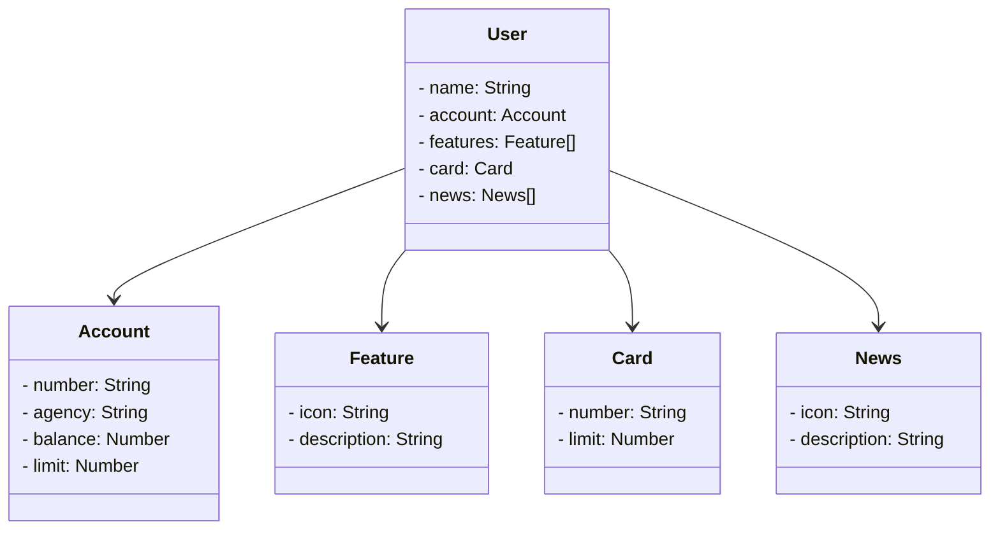

Projeto API RESTful

Diagrama de classes

---

```mermaid
classDiagram
class User {
- name: String
- account: Account
- features: Feature[]
- card: Card
- news: News[]
}

class Account {
- number: String
- agency: String
- balance: Number
- limit: Number
}

class Feature {
- icon: String
- description: String
}

class Card {
- number: String
- limit: Number
}

class News {
- icon: String
- description: String
}

User --> Account
User --> Feature
User --> Card
User --> News
```